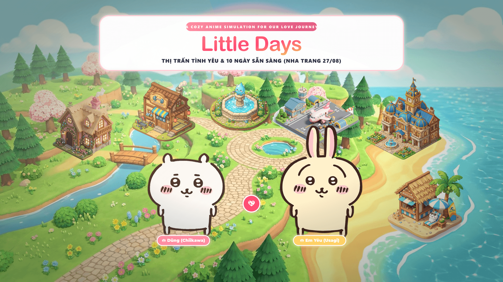
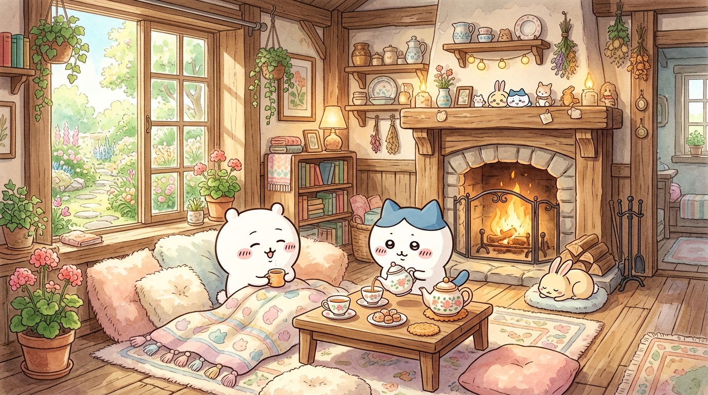
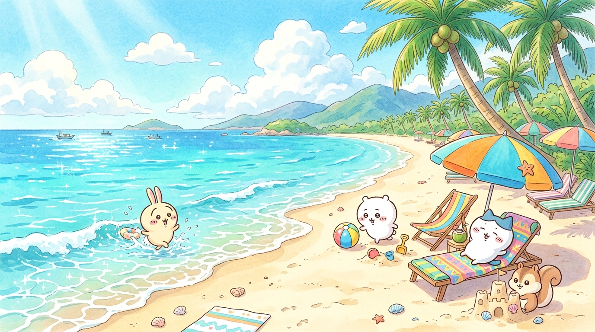
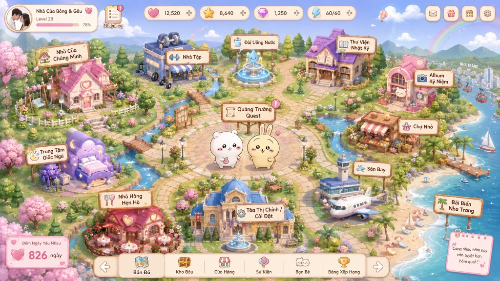
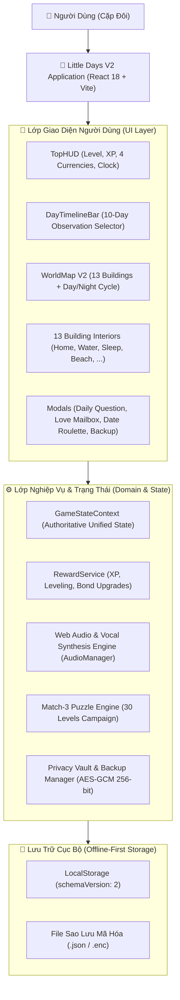

# 🌸 Little Days V2 — Hành Trình Tình Yêu & Thế Giới Thị Trấn Chiikawa

<div align="center">



[](https://github.com/tandung060604-prog/ten-day-readiness-tracker/actions/workflows/deploy-pages.yml)
[-success?style=flat&logo=vitest)](https://vitest.dev/)
[](https://www.typescriptlang.org/)
[](https://react.dev/)
[](https://vitejs.dev/)
[](https://developer.mozilla.org/en-US/docs/Web/API/Web_Crypto_API)
[](https://www.w3.org/WAI/standards-guidelines/wcag/)

**Ứng dụng đồng hành đôi lứa kết hợp game phiêu lưu thế giới mở ấm áp lấy cảm hứng từ vũ trụ hoạt hình Chiikawa đáng yêu.**

[🌐 Trải Nghiệm Bản Live Trực Tiếp (GitHub Pages)](https://tandung060604-prog.github.io/ten-day-readiness-tracker/) • [📖 Tài Liệu Kiến Trúc (Architecture)](./GAME_ARCHITECTURE.md) • [📜 Bản Ghi Phát Hành (Release Notes)](./docs/v2/V2_RELEASE_NOTES.md)

</div>

---

## 📖 Giới Thiệu Tổng Quan (Overview)

**Little Days V2** là một không gian số ngọt ngào và riêng tư dành riêng cho các cặp đôi. Ứng dụng kết hợp giữa việc **theo dõi sức khỏe, tâm sự đôi lứa, lưu giữ kỷ niệm** và **thế giới game thị trấn tương tác 13 công trình sống động**, đưa hai bạn cùng các linh vật hoạt hình Chiikawa trải qua hành trình 10 ngày chuẩn bị đầy ý nghĩa hướng tới chuyến du lịch ngắm hoàng hôn rực rỡ tại Nha Trang.

Ứng dụng tuân thủ triết lý **Offline-First & Quyền Riêng Tư Tuyệt Đối**: 100% dữ liệu, nhật ký, lời nhắn tình yêu và hình ảnh được lưu trữ trực tiếp trên thiết bị của người dùng, được bảo vệ bằng mã hóa **AES-GCM 256-bit** và **Két sắt mã PIN 4 số**.

---

## 📸 Bộ Sưu Tập Không Gian Nội Thất Từng Công Trình (Interior Showcase)

Toàn bộ các phòng nội thất trong thị trấn Little Days V2 được thiết kế với tranh nền Anime Chiikawa độ nét cao, mang phong cách ấm áp của Studio Ghibli:

<div align="center">

| 🏡 Ngôi Nhà Nhỏ (Cozy Home Cottage) | 🏖️ Bãi Biển Thám Hiểm Nha Trang |
|:---:|:---:|
|  |  |
| *Lò sưởi ấm áp, sofa check-in nhận Tim và hộp thư tình* | *Bờ biển nhiệt đới cát vàng, rặng dừa và ghế nghỉ mát* |

| 🍝 Nhà Hàng Hẹn Hò Ánh Nến | 🛏️ Thung Lũng Giấc Ngủ (Sleep Haven) |
|:---:|:---:|
|  |  |
| *Bàn tiệc mì Ý, pizza và vòng quay chọn món ăn hẹn hò* | *Giường mây bồng bềnh, hướng dẫn thở 4-7-8 ngắm trăng sao* |

| ⛲ Đài Phun Nước Ma Thuật (Hydration Fountain) | 🗺️ Bản Đồ Thế Giới Thị Trấn (World Map V2) |
|:---:|:---:|
|  |  |
| *Bình nước detox hoa quả tươi mát, ghi nhận lượng nước uống* | *Bản đồ thị trấn SVG tương tác với chu kỳ Ngày/Đêm động* |

</div>

---

## 🌟 Điểm Nhấn Tính Năng Nổi Bật (Key Features)

### 🗺️ 1. Bản Đồ Thế Giới Sống Động & 13 Công Trình Độc Đáo
- **13 Công trình chi tiết**: Ngôi Nhà Nhỏ, Đài Phun Nước, Tháp Trăng Ngủ Say, Nhà Hàng Ánh Nến, Sân Bay Little Sky, Bãi Biển Nha Trang, Quảng Trường Nhiệm Vụ, Xưởng Ảnh Polaroid, Phòng Khám Yêu Thương, Thư Viện Ký Ức, v.v.
- **Chu kỳ Thời gian & Thời tiết động**: Chuyển giao mượt mà theo thời gian thực (Bình minh, Ban ngày, Hoàng hôn lung linh, Đêm đầy sao).

### 🎭 2. Hệ Thống 6 Linh Vật Chiikawa & Giọng Nói Tương Tác
- Sử dụng mô hình đồ họa anime chính thức: **Chiikawa**, **Usagi**, **Hachiware**, **Momonga**, **Kurimanju**, và **Rakko**.
- **14 Trạng thái cảm xúc FSM & 12 Kỹ năng đôi**: Linh vật biểu cảm khi chạm, nhảy múa, hò reo *"Yaha!"* và tung hiệu ứng phép thuật hỗ trợ giải đố.
- **Hộp phụ đề nổi (Subtitle Toast)**: Hiển thị lời thoại tiếng Việt kèm âm thanh Web Audio sống động.

### 🧩 3. Chiến Dịch Giải Đố Match-3 (30 Màn Chơi & 3 Chương Truyện)
- **Cơ chế xếp hình mượt mà**: Ghép 4 tạo **Tên Lửa Cà Rốt 🚀**, ghép 5 tạo **Cầu Vồng Phép Màu 🌈**, phá chướng ngại vật hộp gỗ và thu thập vật phẩm nhiệm vụ.
- **3 Chương cốt truyện cảm động**:
  - *Chương 1: Tổ Ấm Ngôi Nhà Nhỏ (Màn 1–10)*
  - *Chương 2: Xây Dựng Thị Trấn Hạnh Phúc (Màn 11–20)*
  - *Chương 3: Kỳ Nghỉ Biển Nha Trang (Màn 21–30, Màn 30 Grand Sunset Finale)*

### 🪙 4. Nền Kinh Tế Ảo 4 Tiền Tệ & Nâng Cấp Công Trình
- **4 Loại tiền tệ**: Trái Tim (💖), Tiền Xu (🪙), Ngôi Sao (⭐), và Vé Du Lịch (🎫) — *100% miễn phí, không nạp thẻ, không quảng cáo*.
- **Nâng cấp 3 Bậc (Tier 1 ➔ Tier 3)**: Mở khóa các đặc quyền mới và hào quang Hoàng Kim lộng lẫy cho từng công trình.

### 💌 5. Đời Sống Đôi & Chế Độ Vô Tận (Couple Life Features)
- **Câu hỏi đôi mỗi ngày (Daily Question)**: Hơn 30 câu hỏi tâm sự luân phiên, lưu câu trả lời kỷ niệm (+15 Tim).
- **Hòm thư tình & Viên nang thời gian**: Soạn thư tay mở phong bì sáp niêm phong, hẹn ước mở viên nang vào ngày kỷ niệm.
- **Vòng quay Hẹn hò & Ăn gì**: Gợi ý món ăn ngon và ý tưởng hẹn hò ngẫu nhiên theo tâm trạng.
- **Danh sách ước nguyện (Bucket List)**: Đánh dấu những ước mơ đã cùng nhau thực hiện kèm pháo hoa chúc mừng.

### 🔒 6. Bảo Mật Riêng Tư & An Toàn Dữ Liệu Tuyệt Đối (Offline-First)
- **100% Client-side**: Mọi dữ liệu lưu tại trình duyệt máy (`localStorage`), không gửi lên bất kỳ máy chủ nào.
- **Sao lưu mã hóa AES-GCM 256-bit**: Xuất/nhập file sao lưu có mật khẩu bảo vệ bằng chuẩn PBKDF2 (100,000 vòng lặp).
- **Két sắt mã PIN 4 số**: Khóa an toàn nhật ký và thông tin riêng tư.
- **Di trú V1 ➔ V2**: Tự động chuyển đổi dữ liệu từ phiên bản cũ không mất mát.

---

## 🧩 Danh Sách 6 Linh Vật Đồng Hành (Mascot Characters)

<div align="center">

| Linh Vật | Tên Tiếng Nhật | Biểu Tượng | Vai Trò & Kỹ Năng Đôi |
|:---:|:---:|:---:|:---|
|  | **Chiikawa** (ちいかわ) | 🌸 Mầm Trắng | *Linh vật chính: Trái tim ngọt ngào, tạo Cầu Vồng Phép Màu* |
|  | **Usagi** (うさぎ) | ⚡ Thỏ Năng Động | *Tiếng kêu "Yaha!", phóng Tên Lửa Cà Rốt phá hàng ngang/dọc* |
|  | **Hachiware** (ハチワレ) | 📘 Mèo Thông Thái | *Gia sư thông thái: Tăng +25% điểm kinh nghiệm và đổi vị trí ô* |
|  | **Momonga** (モモンガ) | 💎 Sóc Dễ Thương | *Kỹ năng nũng nịu: Nhân đôi lượng Xu thu thập mỗi màn* |
|  | **Kurimanju** (くりまんじゅう) | 🍵 Hạt Dẻ Thư Giãn | *Thưởng trà bình an: Hồi phục ngay 3 lượt đi trong màn chơi* |
|  | **Rakko** (ラッコ) | ⚔️ Rái Cá Hiệp Sĩ | *Thầy dạy kiếm: Quét sạch 9 ô chướng ngại vật cứng đầu* |

</div>

---

## 🏗️ Kiến Trúc Hệ Thống (Architecture Overview)



---

## 🛠️ Hướng Dẫn Cài Đặt & Chạy Cục Bộ (Local Setup)

### Yêu cầu môi trường:
- **Node.js**: $\ge 18.x$ (Khuyến nghị Node.js 20+)
- **NPM**: $\ge 9.x$

### Các bước cài đặt:
```bash
# 1. Clone repository về máy
git clone https://github.com/tandung060604-prog/ten-day-readiness-tracker.git
cd ten-day-readiness-tracker

# 2. Cài đặt các thư viện phụ thuộc
npm install

# 3. Khởi động môi trường phát triển cục bộ
npm run dev

# 4. Mở trình duyệt và truy cập:
# http://localhost:5173
```

### Chạy kiểm thử tự động (Unit & Integration Tests):
```bash
npm run test
# Kết quả: 16 test suites passed, 128/128 unit tests passed (100%)
```

### Build sản phẩm tối ưu hóa:
```bash
npm run build
# Bản build được xuất vào thư mục /dist với cấu hình tách bundle thông minh
```

---

## 🧪 Báo Cáo Chất Lượng & Độ Bao Phủ Kiểm Thử (Quality Metrics)

```text
✓ src/__tests__/security.test.ts (4 tests)
✓ src/__tests__/audioSystem.test.ts (11 tests)
✓ src/__tests__/coupleFeatures.test.ts (10 tests)
✓ src/__tests__/campaign30Levels.test.ts (6 tests)
✓ src/__tests__/puzzleEngine.test.ts (14 tests)
✓ src/__tests__/economyAndUpgrades.test.ts (8 tests)
✓ src/__tests__/characterSystem.test.ts (13 tests)
✓ src/__tests__/coupleProfile.test.ts (11 tests)
✓ src/__tests__/worldMap.test.ts (10 tests)
✓ src/__tests__/gameState.test.ts (13 tests)
✓ src/__tests__/privacyAndMigration.test.ts (8 tests)
✓ src/__tests__/releaseReadiness.test.ts (4 tests)
✓ src/__tests__/smoke.test.tsx (2 tests)
✓ src/__tests__/polishAndAccessibility.test.tsx (3 tests)
✓ src/__tests__/buildingInteriors.test.tsx (8 tests)
✓ src/__tests__/readiness.test.ts (3 tests)

Test Files: 16 passed (16)
Tests:      128 passed (128) — 100% Green
Build Time: ~750ms (0 Errors / 0 Warnings)
```

---

## 📜 Tuyên Bố Bản Quyền & Miễn Trừ Trách Nhiệm (Disclaimers)

1. **Tuyên bố về hình ảnh nhân vật (Fan Project Disclaimer):**
   *Little Days V2 là một dự án ứng dụng phi lợi nhuận dành riêng cho các cặp đôi. Mọi hình ảnh và nhãn hiệu liên quan đến nhân vật Chiikawa (ちいかわ) thuộc bản quyền của tác giả Nagano (ナガノ) và Chiikawa Production Committee.*
2. **Miễn trừ y tế (Medical Disclaimer):**
   *Các tính năng theo dõi giấc ngủ, uống nước, thể dục và chu kỳ sức khỏe trong ứng dụng phục vụ mục đích hỗ trợ thấu hiểu và chăm sóc lẫn nhau trong tình yêu, không thay thế cho lời khuyên, chẩn đoán hoặc điều trị y khoa chuyên nghiệp.*

---

<div align="center">

**Made with lots of love 💖 for Little Days Couple · 2026**  
*Chúc hai bạn có một hành trình ngập tràn niềm vui, tiếng cười và hạnh phúc bền lâu!* 🌸✨

</div>
