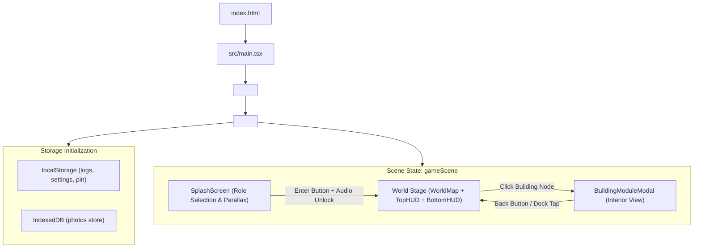
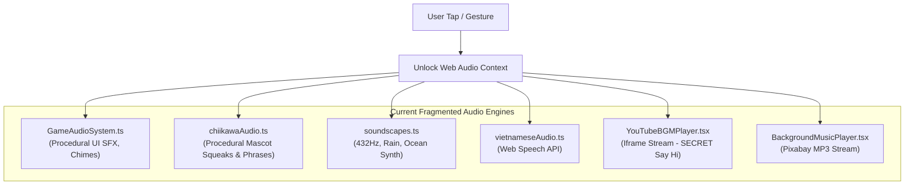

# LITTLE DAYS V2 — CURRENT ARCHITECTURE MAP

**Date:** 2026-08-20  
**Phase:** Phase 00 — Audit & Stabilize Current Code  

---

## 1. Overview & Tech Stack

**Little Days** is a browser-based Single Page Application (SPA) designed as a cozy couple-life adventure and wellness tracker.

### Current Active Stack:
- **Core Framework:** React 19 (`react`, `react-dom`)
- **Language:** TypeScript 5.8+ (Strict Mode)
- **Bundler & Dev Server:** Vite 8.2 (configured for relative base `./` for GitHub Pages)
- **Styling:** Pure Vanilla CSS (`src/styles.css`, ~186KB monolithic file)
- **Icons & Graphics:** Custom inline SVG icons (`GameIcons.tsx`, `ChiikawaSVG.tsx`), Canvas animations (`MapAnimationCanvas.tsx`)
- **Client Storage:** 
  - `localStorage` for `logs`, `settings`, `menstrual_settings`, `menstrual_logs`, `audio_settings`.
  - `IndexedDB` (`readiness-photo-db`) for user-uploaded meal & memory photos.
- **Audio:** Web Audio API procedural synthesizers (`GameAudioSystem.ts`, `soundscapes.ts`, `chiikawaAudio.ts`), Web Speech API synthesis (`vietnameseAudio.ts`), and YouTube IFrame API (`YouTubeBGMPlayer.tsx`).

---

## 2. System Boot & Runtime Flow

---

## 3. Top-Level State Architecture (`App.tsx`)

| State Slice | Type / Source | Purpose | Persistence Key |
|---|---|---|---|
| `gameScene` | `'splash' \| 'map' \| 'module'` | Governs top-level view presentation | Ephemeral (Session) |
| `currentLocation` | `LocationId \| 'map'` | Active building location ID | Ephemeral (Session) |
| `logs` | `DailyLog[]` | 10-day tracking data (sleep, meals, hydration, workout, checklist) | `localStorage['ten-day-readiness-v1']` |
| `settings` | `AppSettings` | Target times, hydration goal, theme, PIN security | `localStorage['ten-day-readiness-settings-v1']` |
| `activeRole` | `'chiikawa' \| 'usagi'` | Currently chosen companion character | Ephemeral (Session) |
| `activeTransition` | `{ type: TransitionType, isActive: boolean }` | Screen transition wipe overlay state | Ephemeral (Session) |
| `isLocked` | `boolean` | PIN screen lock status | Evaluated from `settings.pinHash` |
| `inventoryItems` | `InventoryItem[]` | Backpack items (currently static initial array) | In-Memory (Phase 02 target) |

---

## 4. Current 13 Buildings & Views Registry

| # | Location ID | In-Game Building Name | Companion | Transition Wipe | Rendered Component | Current Status |
|---|---|---|---|---|---|---|
| 1 | `home` | **Nhà Của Chúng Mình** | Chiikawa 🐹 | `heart` | `<TodayView />` | Active (Contains Hero Card & Daily Log) |
| 2 | `quests` | **Quảng Trường Quest** | Hachiware 🐱 | `cloud` | `<PlanView />` | Active (10-day overview) |
| 3 | `gym` | **Nhà Tập (Gym & Dojo)** | Usagi 🐰 | `cloud` | `<TrainingView />` | Active (Workout routine & motions) |
| 4 | `water` | **Đài Uống Nước** | Hachiware 🐱 | `water` | `<TodayView />` | *Duplicate view (Needs bespoke interior in V2)* |
| 5 | `sleep` | **Trung Tâm Giấc Ngủ** | Kurimanju 🦦 | `moon` | `<TodayView />` | *Duplicate view (Needs bespoke interior in V2)* |
| 6 | `journal` | **Thư Viện Nhật Ký** | Chiikawa 🐹 | `book` | `<JournalView />` | Active (Daily notes & mood metrics) |
| 7 | `album` | **Album Kỷ Niệm** | Momonga 🐿️ | `camera` | `<InsightsView />` | Active (Photo strip & readiness trend) |
| 8 | `market` | **Chợ Nhỏ (Nutrition)** | Momonga 🐿️ | `cloud` | `<MealsView />` | Active (Food logging & calorie tracker) |
| 9 | `restaurant` | **Nhà Hàng Biển** | Chiikawa 🐹 | `heart` | `<TodayView />` | *Duplicate view (Needs date planner in V2)* |
| 10 | `airport` | **Sân Bay Quốc Tế** | Rakko ⭐ | `plane` | `<TodayView />` | *Duplicate view (Needs trip countdown in V2)* |
| 11 | `beach` | **Bãi Biển Nha Trang** | Usagi 🐰 | `water` | `<TodayView />` | *Duplicate view (Needs adventure map in V2)* |
| 12 | `settings` | **Tòa Thị Chính** | Rakko ⭐ | `gear` | `<SettingsView />` | Active (Data export, backup, PIN, theme) |
| 13 | `hospital` | **Bệnh Viện Tình Yêu** | Kurimanju 🦦 | `heart` | `<LoveHospitalView />` | Active (Menstrual cycle engine & care tips) |

---

## 5. Audio Subsystem Map

*Note:* In Phase 06 (`07_PHASE_06_AUDIO_VOICE_V2.md`), these will be unified into a cohesive `AudioManager` singleton with a shared `AudioContext` and lifecycle cleanup.

---

## 6. Data Persistence & Local Storage Schema

### Keys in `localStorage`:
- `ten-day-readiness-v1`: Serialized `DailyLog[]` (10 items containing meal logs, hydration amounts, workout checklist, metrics).
- `ten-day-readiness-settings-v1`: Serialized `AppSettings` (target bedtime, wake time, water target, PIN hash).
- `flo_menstrual_settings_v1`: Cycle length, period duration, luteal phase length, last period date.
- `flo_menstrual_logs_v1`: Array of daily symptom logs, flow intensity, mood.
- `little_days_audio_settings_v1`: Master volume, BGM volume, SFX volume, mute state.

### Store in `IndexedDB` (`readiness-photo-db` v1):
- Object Store: `photos`
- Key: Photo ID (e.g. `meal-d1-photo-0`)
- Value: `Blob` image data (prevents overflowing the 5MB `localStorage` limit).

---

## 7. Deployment & Build Pipeline

- **Build Target:** Static HTML/JS/CSS output to `dist/`.
- **Base Path:** Relative `./` configured in `vite.config.ts`, making it immediately compatible with GitHub Pages or any sub-path hosting.
- **TypeScript:** Strict compilation with `tsc -b`.
