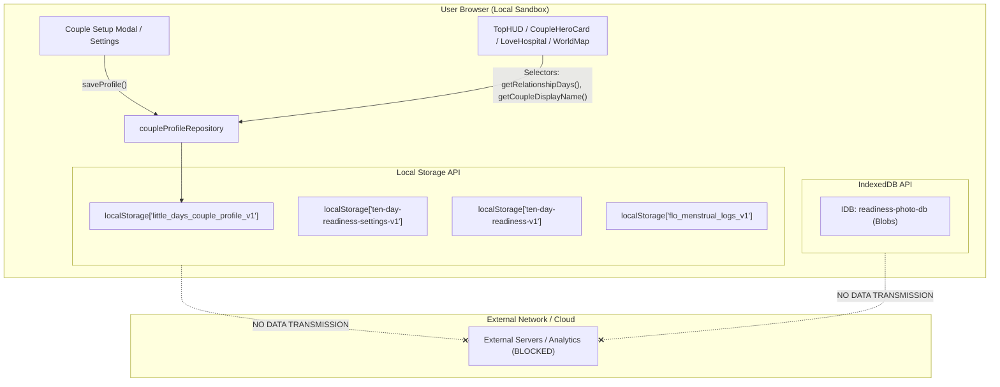

# LITTLE DAYS V2 — PERSONALIZATION & LOCAL-FIRST PRIVACY ARCHITECTURE

**Date:** 2026-08-20  
**Phase:** Phase 01 — Data Model & Couple Profile  
**Status:** Approved  

---

## 1. Principles of Privacy in Little Days

Little Days is designed as an intimate couple sanctuary. It tracks deeply personal aspects of everyday life—including sleep patterns, emotions, romantic milestones, menstrual cycle logs, and private memories.

Because the repository is hosted publicly (e.g. GitHub Pages), **privacy is non-negotiable**.

### Core Tenets:
1. **Local-First Storage:** All personal data is stored exclusively on the user's device (`localStorage` and `IndexedDB`).
2. **Zero Unintended Exfiltration:** No telemetry, no third-party analytics trackers, no silent cloud database synchronization.
3. **Safe Out-of-the-Box Demo Mode:** The source code contains only fictional/demo fixtures (`Haru` 🐹 and `Mai Trang / Mochi` 🐰).
4. **Transparent User Sovereignty:** Users can export a complete single-file JSON backup (`LittleDays_Backup_YYYY-MM-DD.json`) or purge all data in one tap.
5. **Security Gate (Optional PIN / Biometrics):** Local SHA-256 salted PIN hash lock and WebAuthn biometrics prevent casual inspection when sharing devices.

---

## 2. Data Classification Matrix

| Classification Level | Data Types Included | Storage Medium | Repository Safety | Masking & Protection |
|---|---|---|---|---|
| **Level 1: Public / Demo Data** | Default character sprites, town building layouts, sample recipes, exercise instructions, fictional demo dates. | Bundled in TypeScript source code | ✅ 100% Safe in public git repo | None needed |
| **Level 2: Personal Local Data** | Real partner nicknames, relationship start date, city/timezone, custom date countdowns, goals. | `localStorage['little_days_couple_profile_v1']` | ❌ Never in git repo | Configured via first-run Onboarding / Settings |
| **Level 3: Sensitive Local Data** | Menstrual cycle symptoms, intimate health logs, private daily journals, user-uploaded meal/memory photos. | `localStorage` (encrypted/isolated keys) & `IndexedDB` (`readiness-photo-db`) | ❌ Strictly local only | Shielded behind PIN Lock and optional Privacy Mode camouflage |

---

## 3. Data Flow Diagram

---

## 4. Onboarding & First-Run Experience

When a user visits the application for the first time without prior saved profile data:
1. **Welcome Step:** Introduction to the Little Days living town.
2. **Player Identification:** Input custom nicknames for Player 1 and Player 2.
3. **Mascot Alignment:** Choice of Chiikawa 🐹 (warm & nurturing) or Usagi 🐰 (energetic & adventurous).
4. **Milestone Configuration:** Optional relationship anniversary and upcoming trip dates.
5. **Privacy Affirmation:** Clear explanation of device-only storage.
6. **Demo Mode Fast-Forward:** Instant "Dùng dữ liệu mẫu" button for rapid evaluation without typing.
