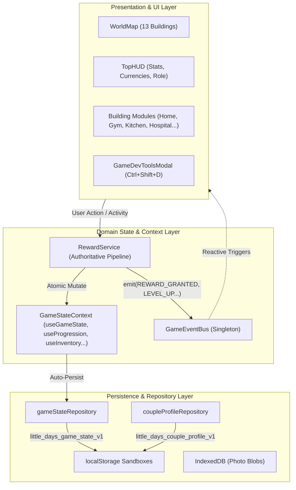

# LITTLE DAYS V2 — TECHNICAL ARCHITECTURE SPECIFICATION

**Date:** 2026-08-20  
**Phase:** Phase 02 — Game State Architecture  
**Status:** Approved  

---

## 1. System Overview

Little Days V2 is a local-first, intimate couple life-sim and daily readiness application. The technical architecture follows clean domain boundaries, pure selector derivations, an Authoritative Reward Pipeline, and an internal Typed Event Bus.

---

## 2. Architectural Pillars

### 2.1 Domain Separation (No Monolithic God-Components)
State is segregated by lifecycle and business logic:
- **`CoupleProfile`**: Identity, nicknames, mascot character, anniversaries.
- **`GameState`**: Levels, XP curves, Bond XP, currencies, inventory, building tiers, quests, adventure campaigns.
- **`MenstrualEngine`**: Biometric cycle calculation, phase detection, symptoms, care guides.
- **`ReadinessEngine`**: Daily score calculation, sleep cycle assessment, hydration progress.

### 2.2 Authoritative Reward Pipeline (`RewardService`)
To eliminate duplicate reward calculations in UI components:
1. Actions (e.g. completing a workout, drinking water, logging sleep, writing a diary message) call `grantReward(RewardGrant)`.
2. `RewardService.processReward()` executes atomic math:
   - Increments currency balances.
   - Calculates XP and level-ups using curve $XP_{req} = 100 \times 1.25^{(level - 1)}$.
   - Calculates Bond XP and bond-ups using curve $BondXP_{req} = 100 \times 1.2^{(bondLevel - 1)}$.
   - Stacks inventory items or creates new slots respecting `maxStack`.
   - Levels up buildings up to tier 3.
3. Automatically dispatches typed events (`LEVEL_UP`, `BOND_LEVEL_UP`, `BUILDING_UPGRADED`, `REWARD_GRANTED`).
4. Persists the new state atomically.

### 2.3 Strongly Typed Event Bus (`GameEventBus`)
Allows UI layers, sound systems, and mascot cheer animations to react to gameplay milestones without prop drilling.

Supported Events:
- `ACTIVITY_COMPLETED`
- `REWARD_GRANTED`
- `LEVEL_UP`
- `BOND_LEVEL_UP`
- `BUILDING_UPGRADED`
- `INVENTORY_UPDATED`
- `QUEST_COMPLETED`
- `ADVENTURE_CHAPTER_COMPLETED`
- `CURRENCY_CHANGED`

---

## 3. Storage Key Catalog

| Key | Format | Purpose |
|---|---|---|
| `little_days_couple_profile_v1` | JSON | Couple personalization & identity |
| `little_days_game_state_v1` | JSON | Authoritative progression, inventory, currencies, building tiers |
| `ten-day-readiness-v1` | JSON | Daily logs (workouts, nutrition, hydration) |
| `ten-day-readiness-settings-v1` | JSON | User preferences, theme, security PIN hash |
| `flo_menstrual_settings_v1` | JSON | Menstrual cycle algorithm parameters |
| `flo_menstrual_logs_v1` | JSON | Intimate health symptom logs |
| `readiness-photo-db` | IndexedDB | Local photo blobs & date polaroids |
