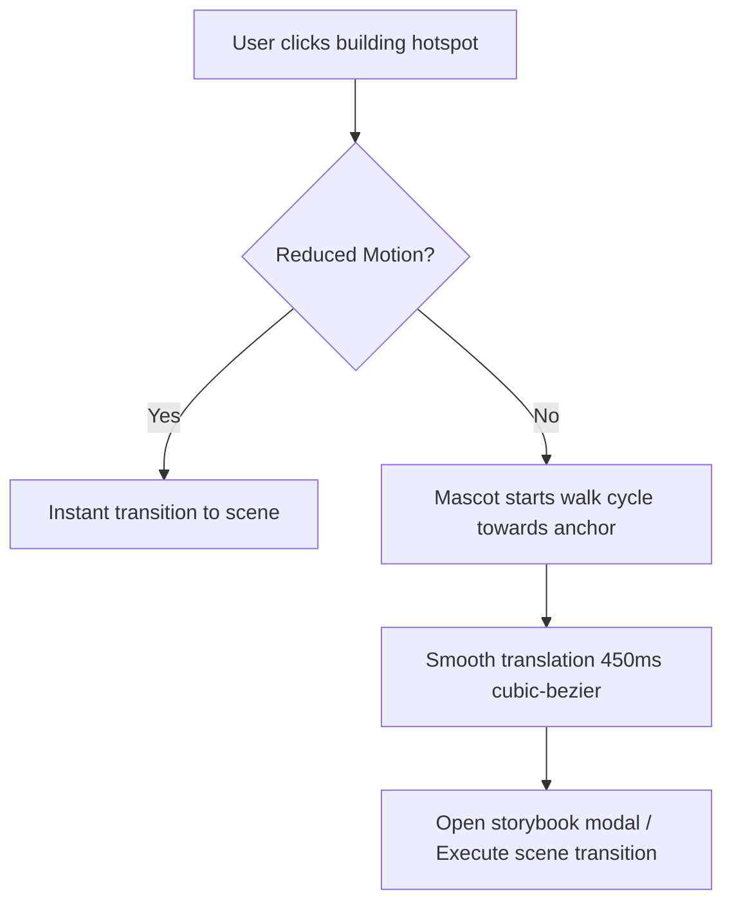

# Living World Map V2 Specification

## 1. Overview & Aesthetic Vision

The **Little Days Living World Map V2** transforms the town map from a static hotspot canvas into an organic, living storybook world inspired by Japanese pastoral watercolor games (Chiikawa, Animal Crossing, Ghibli).

---

## 2. Core World Systems

### A. Living Time-of-Day & Atmospheric Engine
The world calculates real-time atmospheric conditions according to the couple's local timezone clock:

| Period | Time Window | Sky Gradient & Mood | Ambient Filter | Celestial Body | Particles |
|---|---|---|---|---|---|
| **Morning** | 05:00 – 10:59 | Fresh sunrise, pastel peach & sky blue | Soft warmth & clarity | Rising Sun ☀️ | Sakura Petals |
| **Afternoon** | 11:00 – 16:59 | Radiant azure daylight, high clarity | Crisp contrast | High Sun ☀️ | Sparkling Sunbeams |
| **Sunset** | 17:00 – 18:59 | Romantic coral pink, gold & amber | Sepia glow, evening twilight | Setting Sun 🌅 | Drifting Leaves |
| **Night** | 19:00 – 04:59 | Deep indigo, starry navy night | Moonlit cool tint, cozy warmth | Crescent Moon 🌙 | Glowing Fireflies |

### B. Dynamic Environmental Details
1. **Chimney Smoke Puffs:** Animated steam rising softly from cottages (`home`, `gym`, `restaurant`, `journal`).
2. **Living Water Ripple:** Interactive river shimmer and beach ocean wave dynamics.
3. **Cottage Window Light Glow:** At sunset (0.6 opacity) and night (0.95 opacity), windows radiate cozy warm amber light.
4. **Active Celestial Arc:** Sun and Moon follow a calculated mathematical parabolic arc across the sky based on the current hour.

---

## 3. Character Locomotion & Navigation Pipeline

When a user interacts with a building on the map:

- **Character Anchors:** Each of the 13 locations defines a dedicated `{x, y}` landing coordinate for the player mascot.
- **Facing Detection:** The mascot flips automatically along the X-axis (`scaleX(1)` vs `scaleX(-1)`) towards the target building.

---

## 4. Seasonal Themes Engine

Dynamic detection of significant real-world and relationship milestones:
- **Anniversary Mode:** Triggered on the couple's relationship start date.
- **Nha Trang Trip Countdown:** Active during the late-August flight departure window (Aug 17–28).
- **Holidays:** Automatic atmospheric decorations for Valentine's Day (Feb 14) and Christmas (Dec 24–25).

---

## 5. Performance & Accessibility Guarantees

- **No Canvas Lockup:** Base terrain and animated rivers are rendered with hardware-accelerated CSS/SVG layers.
- **Full Keyboard Navigation:** All 13 buildings have `tabIndex={0}`, ARIA labels, and `Enter`/`Space` actuation.
- **Reduced Motion Support:** Users with motion sensitivity or low-power devices experience instantaneous transitions without camera shake or heavy walking loops.
